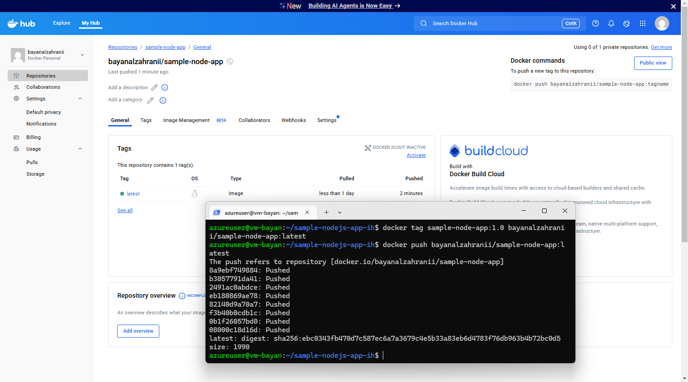
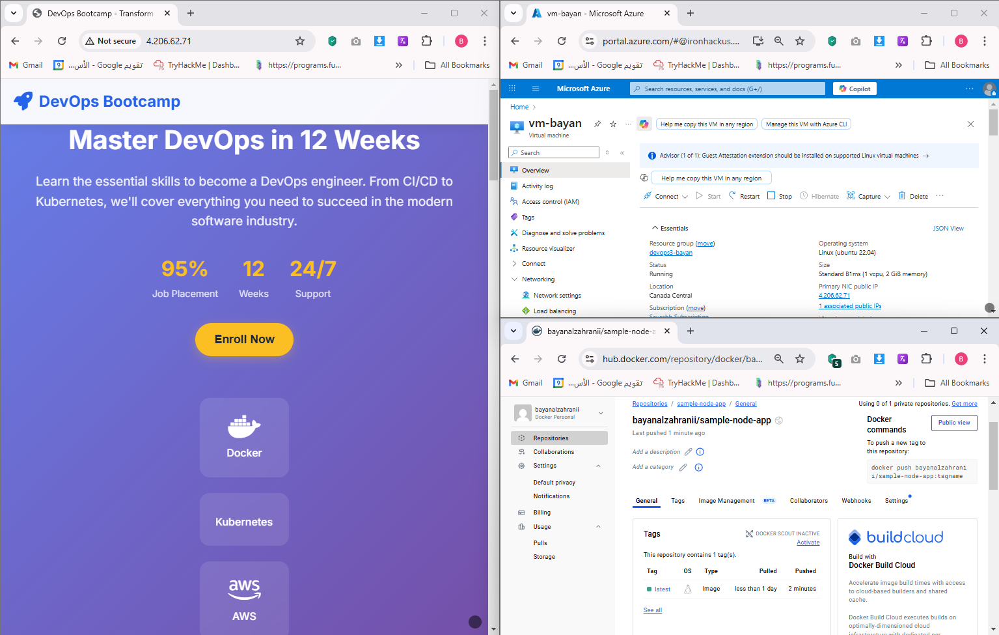

# Lab Solution - Week 3 Day 
# Lab1
# Docker Installation

### Run Docker

# Lab Solution - Week 3 Day 1 
# Lab2
# Containerise a standalone NodeJs Application

# Lab Solution - Week 3 Day 1 
# Lab3
# Practising Docker Commands

